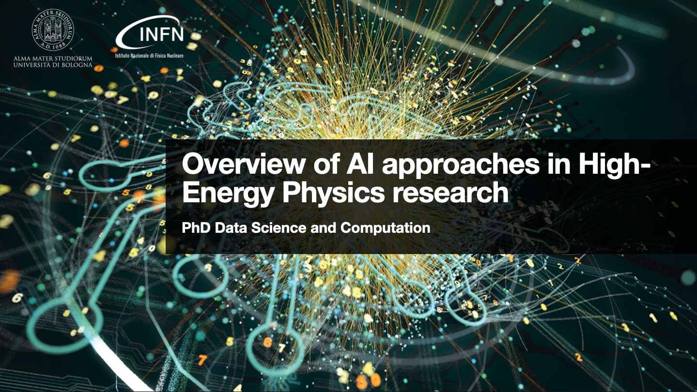

# Overview of AI approaches in HEP research

This repository contains the material for the PhD course in Data Science and Computation, at the University of Bologna.

The structure is organized as follows:

[TMVA_Higgs_Classification](TMVA_Higgs_Classification/): First hands-on on a simple classification use-case, using the publicly available [Higgs UCI dataset](http://archive.ics.uci.edu/ml/datasets/HIGGS). 
> [!NOTE]  
> This hands-on is inspired from the ROOT-TMVA [tutorial](https://root.cern/doc/v630/TMVA__Higgs__Classification_8py.html).

## Credits
FIXME